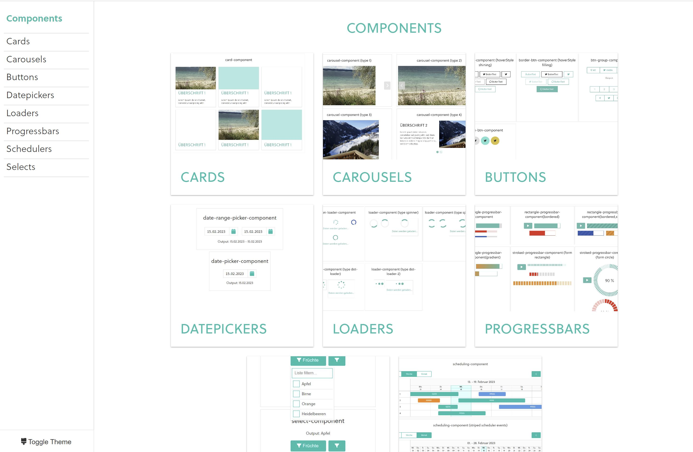

# Angular Component Library

This project is a collection of Angular standalone components and it was generated with [Angular CLI](https://github.com/angular/angular-cli) version 15.0.2.

## Demo 

[https://susannstruwe.github.io/angular-component-library/](https://susannstruwe.github.io/angular-component-library/#/)

## Development

Run `ng serve` for a dev server. Navigate to `http://localhost:4200/`. The application will automatically reload if you change any of the source files.

## Build

Run `ng build` to build the project. The build artifacts will be stored in the `dist/` directory.

## License 
MIT